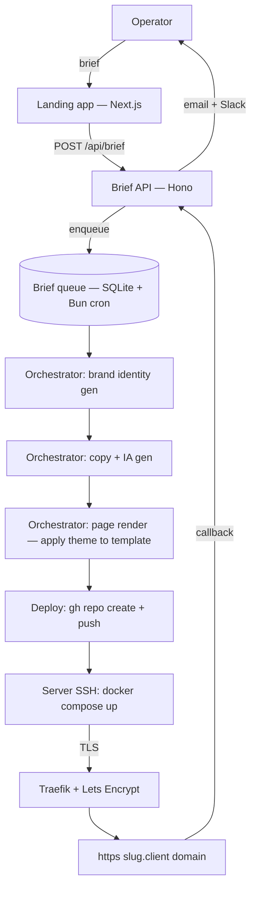

# 02 — Architecture

## System overview

Pagewright is a thin orchestration layer over (a) an LLM-driven brand+copy generator, (b) a Next.js template renderer, (c) an automated deploy pipeline. The product surface is a brief form; the product output is a live URL.



## Components

| Component         | Tech                          | Responsibility                                                       |
|-------------------|-------------------------------|----------------------------------------------------------------------|
| `apps/landing`    | Next.js 15 App Router + ShadCN | Marketing site for Pagewright itself; hosts the brief intake form.       |
| `apps/app`        | wasp-lang/open-saas (forked)  | (Wave 3+) Auth, billing, dashboard, brief history, page versioning.  |
| Brief API         | Bun + Hono + SQLite           | Receives briefs, enqueues jobs, exposes `/status/:id` polling.       |
| Orchestrator      | Bun + Anthropic SDK + GitHub API | Runs the four-step generation pipeline.                             |
| Renderer          | Next.js standalone build      | Each output landing IS a `apps/landing` clone with theme overrides.  |
| Deploy runner     | SSH + docker compose          | `gh repo create` per output, push, ssh + compose up on storage-contabo. |
| Reverse proxy     | dokploy-traefik (host network) | TLS termination, ACME via HTTP-01 letsencrypt resolver.             |

## Data flows

1. **Intake**: form POST → API → SQLite row `briefs(id, payload, status='queued')`. Acknowledge in <300ms.
2. **Brand pass**: orchestrator pulls brief; calls Claude with the brand-pyramid template; writes `briefs.brand_json`.
3. **Copy pass**: orchestrator calls Claude with brand_json + brief; produces hero, feature triad, social proof slot, CTA, footer; writes `briefs.copy_json`.
4. **Press pass**: orchestrator clones `templates/landing-base`, injects `theme.css` + `content.json`, runs `pnpm build`, captures stdout/stderr.
5. **Deploy pass**: orchestrator calls `gh repo create prin7r-projects/<slug>`, `git push`, then `ssh storage-contabo "cd /opt/prin7r-deploys/<slug> && git pull && docker compose up -d"`. Polls `https://<slug>.<client-domain>/` with curl until 200 + valid cert (max 5 min).
6. **Notify**: writes `briefs.url + status='live'`, fires webhook, sends email.

## Deploy topology

```
+-----------------------------+        +-----------------------------+
|  Cloudflare DNS             |        |  GitHub                     |
|  *.prin7r.com -> 161.97.99.120 |     |  prin7r-projects/<slug>     |
+-------------+---------------+        +--------------+--------------+
              |                                       ^
              v                                       |
+-----------------------------+   ssh + git pull       |
|  storage-contabo            +-----------------------+
|  Traefik (host network)     |
|  ACME HTTP-01 letsencrypt   |
|  +-----------------------+  |
|  | /opt/prin7r-deploys/  |  |
|  |   <slug>/             |  |
|  |     docker-compose.yml|  |
|  |     Dockerfile.landing|  |
|  |     apps/landing/     |  |
|  +-----------------------+  |
|        | container :3000    |
|        v                    |
|  Next.js 15 standalone      |
+-----------------------------+
```

## Why these choices

- **Bun + Hono** for the API: a single-binary runtime; cold-start sub-100ms; native fetch and TS without a build step.
- **SQLite over Postgres** for v1: queue volume is tiny (<10k briefs/yr in plausible plan); WAL mode handles concurrency.
- **Per-tenant repo + container**: no multi-tenancy bug surface; each landing is an independent artifact; rollback is `git revert`.
- **Traefik over Caddy**: matches the rest of the prin7r-projects fleet, single ACME pool, single config language.
- **Open-SaaS for the eventual app shell**: Wasp's compile-down emits a vanilla React + Express app — easy to eject from later if the framework choice ages.

## How this very pipeline works

This product packages a workflow that is already running in production: the **prin7r-projects Wave 2 pipeline** generates 20 standalone landings (this one included) by running the same four passes — brand → copy → press → deploy — in parallel from a single playbook. Each Wave 2 build is dispatched as a fresh Claude Opus 4.7 agent with:

1. A **playbook** (`/Users/keer/projects/prin7r/wave2-playbook.md`) describing infra, conventions, and the deliverable contract.
2. A **per-project assignment** (slug, Notion opportunity ID, stack, summary, brand-identity hint).
3. A **Notion knowledge base** as ground truth — opportunity row, status notes, body content, parent strategy.
4. A **target server** (`storage-contabo`, Traefik + ACME) with a wildcard DNS record already in place.

The agent reads the playbook + opportunity, generates the brand identity + 10 strategy docs, scaffolds the monorepo, pushes to `github.com/prin7r-projects/<slug>`, SSHes to the server, brings up the container, verifies HTTPS within 5 minutes, then writes the artifacts back into the Notion opportunity (Source URL, Status Notes, body bullets linking to repo + deploy + sub-page docs).

The same pipeline, productized for non-Prin7r users, becomes Pagewright. The brief intake replaces the per-project assignment. The Notion read-back becomes a customer-facing dashboard. Everything else is identical.

This is the strongest possible proof: **the product's own marketing site was built by the product itself**, alongside 19 sibling landings, on the same day, with the same pipeline.

## Failure modes & mitigations

| Failure                                  | Mitigation                                                                  |
|------------------------------------------|------------------------------------------------------------------------------|
| LLM produces off-brand copy              | Brand-pyramid pass first; copy pass receives brand_json as immutable input. |
| Build fails inside container             | Orchestrator captures `next build` output; aborts and rolls back the repo.  |
| ACME rate limit                          | Use existing wildcard cert until per-host vol justifies LE upgrade tier.    |
| Server overload                          | Storage-contabo has spare capacity; load-balance batch builds nightly.      |
| Customer wants edits post-deploy         | Apps/app dashboard exposes `re-press with diff` (planned Wave 3).          |
