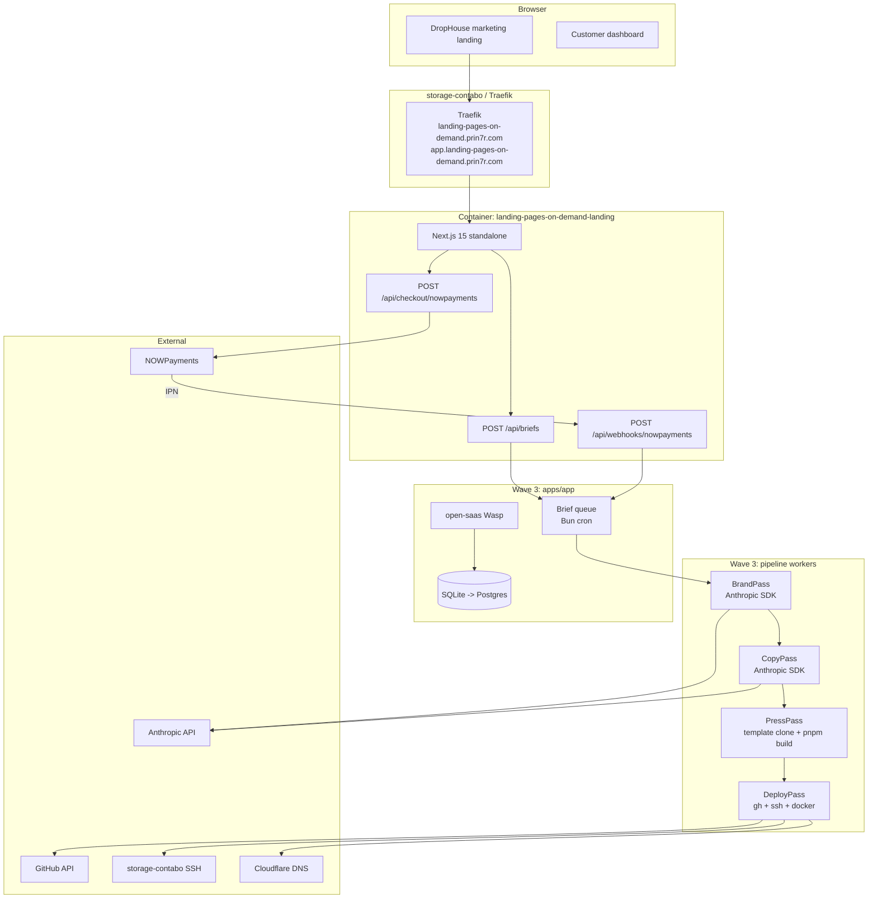
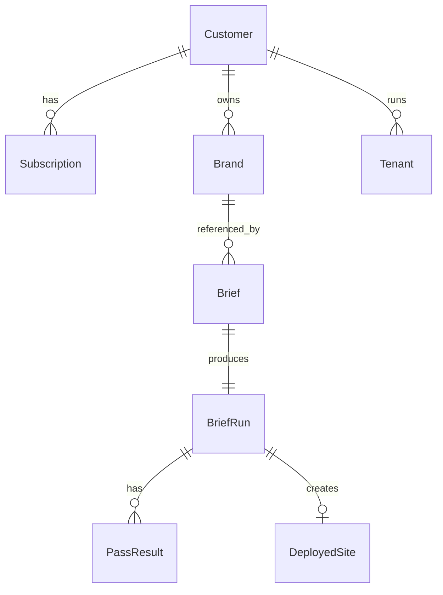

# 12 — Technical Specification

This is the authoritative technical contract for DropHouse Wave 2 → Wave 3. Doc 11 specifies user-visible flows; this doc specifies runtime, schema, contracts, and operational guardrails. Every endpoint here traces back to a story in doc 11.

---

## 1. Architecture overview

DropHouse is a **brief-to-URL pipeline**: 4-pass generation (Brand → Copy → Press → Deploy) that produces a fully deployed landing on the customer's domain in <30min p95.



---

## 2. Data model

### 2.1 Entities



### 2.2 Schema sketch (Drizzle)

```typescript
export const customers = pgTable('customers', {
  id: uuid('id').primaryKey().defaultRandom(),
  email: text('email').notNull().unique(),
  ghOrg: text('gh_org'),  // for repo transfer on cancel
  agencyPartnerCode: text('agency_partner_code'),
});

export const subscriptions = pgTable('subscriptions', {
  id: text('id').primaryKey(),
  customerId: uuid('customer_id').references(() => customers.id),
  tier: text('tier').notNull(),   // 'free'|'single'|'retainer'
  status: text('status').default('pending'),
  validUntil: timestamp('valid_until'),
  briefsRemaining: integer('briefs_remaining'),  // for single (=1)
});

export const brands = pgTable('brands', {
  id: uuid('id').primaryKey().defaultRandom(),
  customerId: uuid('customer_id').references(() => customers.id),
  name: text('name').notNull(),
  paletteJson: jsonb('palette_json'),
  fontPair: text('font_pair'),
  logoSvg: text('logo_svg'),
});

export const briefs = pgTable('briefs', {
  id: text('id').primaryKey(),    // 'brief_<ts>_<rand>'
  customerId: uuid('customer_id').references(() => customers.id),
  brandId: uuid('brand_id').references(() => brands.id),
  payload: jsonb('payload').notNull(),  // form fields
  customDomain: text('custom_domain').notNull(),
  status: text('status').default('queued'),  // 'queued'|'brand'|'copy'|'press'|'deploy'|'live'|'error'|'awaiting_dns'|'awaiting_approval'
  createdAt: timestamp('created_at').defaultNow(),
  liveAt: timestamp('live_at'),
});

export const briefRuns = pgTable('brief_runs', {
  id: uuid('id').primaryKey().defaultRandom(),
  briefId: text('brief_id').references(() => briefs.id),
  startedAt: timestamp('started_at').defaultNow(),
  completedAt: timestamp('completed_at'),
});

export const passResults = pgTable('pass_results', {
  id: uuid('id').primaryKey().defaultRandom(),
  runId: uuid('run_id').references(() => briefRuns.id),
  passKind: text('pass_kind').notNull(),  // 'brand'|'copy'|'press'|'deploy'
  status: text('status').notNull(),       // 'success'|'error'
  outputJson: jsonb('output_json'),
  errorMessage: text('error_message'),
  startedAt: timestamp('started_at'),
  completedAt: timestamp('completed_at'),
});

export const deployedSites = pgTable('deployed_sites', {
  id: uuid('id').primaryKey().defaultRandom(),
  briefId: text('brief_id').references(() => briefs.id),
  url: text('url').notNull(),
  ghRepo: text('gh_repo').notNull(),
  certIssuedAt: timestamp('cert_issued_at'),
  drophouseCreditEnabled: boolean('drophouse_credit_enabled').default(true),
});
```

Indexes: `briefs(customer_id, status)`, `passResults(run_id, pass_kind)`.

---

## 3. API contracts

### 3.1 `POST /api/briefs`

- Auth: customer JWT (or session); free tier accepts unauth with email gating.
- Body: `{ businessName, audience, valueProp, primaryCta, tone, paletteHint, customDomain, brandId?, brandAssets? }`.
- Returns 201: `{ briefId, statusUrl, estimatedCompleteAt }`.

### 3.2 `GET /api/briefs/:id`

- Auth: owner only.
- Returns: brief + runs + passResults + deployedSite if any.

### 3.3 `POST /api/briefs/:id/revise`

- Auth: owner.
- Body: `{ patches: { copy?, brand?, press? } }`.
- Triggers selective re-pass.

### 3.4 `POST /api/briefs/:id/approve`

- Auth: preview-token-bearer (24h-signed).
- Triggers deploy pass.

### 3.5 `POST /api/checkout/nowpayments`

- Body: `{ tier: 'single'|'retainer' }`.
- Returns 201: `{ invoice_url, invoice_id, subscriptionId }`.

### 3.6 `POST /api/webhooks/nowpayments`

- HMAC-SHA512 IPN. Idempotent. On `finished`, activate subscription.

### 3.7 `POST /api/account/cancel`

- Auth: customer JWT.
- Body: `{ transferReposTo? }`.
- Cancels subscription; if `transferReposTo`, queues `gh repo transfer` for each generated repo.

### 3.8 `GET /api/preview/:token`

- Auth: signed token (24h TTL).
- Renders pre-deploy preview HTML (no DNS yet).

### 3.9 `POST /api/admin/briefs/:id/retry`

- Auth: Bearer admin.
- Triggers retry of failed pass.

---

## 4. Integrations

| Service | Purpose | Auth | Rate limit | Fallback |
|---|---|---|---|---|
| **NOWPayments** | Hosted invoice + IPN | `x-api-key` + HMAC-SHA512 | 60 req/min | Plisio + Reown wired Wave 4 |
| **Anthropic API** | Brand + Copy passes | API key | 4k req/s Sonnet 4.6 | Fallback to Haiku 4.5 with reduced output quality |
| **GitHub API** | Repo create + push + transfer | `gh` CLI auth (token) | 5k req/h | Retry 3x exp-backoff; alert on persistent fail |
| **storage-contabo SSH** | Compose up per generated site | SSH key auth | n/a | Fail brief; ops-desk page |
| **Cloudflare DNS** | DNS check on custom domains | API token | 1.2k req/5min | Skip pre-flight check after 5min poll; retry deploy on customer's manual DNS update |
| **Postmark** | Brief status emails | Server token | 5k/h Pro | Buffer; retry |

---

## 5. Storage

- **Wave 2.** Stateless landing.
- **Wave 3 MVP.** SQLite at `/opt/prin7r-deploys/landing-pages-on-demand/data/app.sqlite`. WAL mode.
- **Wave 3 production.** Postgres if brief volume exceeds 10k/year.
- **Generated sites.** Each site lives in its own `gh repo` + own container on storage-contabo at `/opt/prin7r-deploys/<slug>/`. No shared state.
- **Retention.**
  - Briefs + runs: indefinite.
  - PassResult outputs: 90 days (replay-able from brief).
  - Generated repos: lifetime of subscription + 30 days post-cancellation.

---

## 6. Auth

- Public landing: no auth.
- Brief submission (free tier): email gating + magic-link verification.
- Customer dashboard: open-saas magic-link.
- Admin: Bearer + Wasp role gating.
- Preview tokens: 24h HMAC-signed.

---

## 7. Security

Top 5 threats + mitigations:

1. **Forged IPN.** *Mitigation:* HMAC-SHA512 + constant-time compare.
2. **Free-tier abuse.** *Mitigation:* Email-gated 1 page/email; honeypot on form; daily anomaly alert.
3. **LLM prompt injection in brief payload.** *Mitigation:* Brief schema strict; LLM prompts hardcoded with role anchoring; output validated against expected JSON shape.
4. **Generated-site abuse (illegal content).** *Mitigation:* Pre-press content filter (forbidden topics regex); post-deploy random sampling by ops desk; takedown protocol in `/docs/runbooks/takedowns.md`.
5. **Custom-domain takeover (customer's CNAME points away mid-deploy).** *Mitigation:* TLS issuance gated on DNS verification; if CNAME flips after deploy, container survives until next config push.

CSRF: Next.js + samesite. CORS: locked to `landing-pages-on-demand.prin7r.com` + `app.landing-pages-on-demand.prin7r.com`.

---

## 8. Observability

- **Logs.** Stdout JSON `{ ts, level, route, briefId?, passKind?, event, message }`. PII scrubbed.
- **Metrics.** Wave 3: brief-completion-time p95/p99 per pass; brief-error-rate per pass; daily brief volume.
- **Alerts.**
  - Brief stuck >45min in any pass → Slack `#alerts-drophouse`.
  - Daily brief volume <2σ below mean → Slack.
  - Anthropic API 5xx >5/h → Slack.
  - GitHub API 5xx >5/h → Slack.

---

## 9. Performance budgets

| Surface | Metric | Budget |
|---|---|---|
| Landing TTFB | p95 | <200ms |
| Landing LCP | p75 | <2.5s |
| `POST /api/briefs` | p95 | <500ms |
| End-to-end brief → live | p95 | <30min |
| Brand pass | p95 | <3min |
| Copy pass | p95 | <5min |
| Press pass | p95 | <8min |
| Deploy pass | p95 | <12min |
| Generated-site LCP | p75 | <2.5s |
| Throughput sustained | 50 briefs/day; 10 concurrent passes |

---

## 10. Non-goals

- **No multi-page output** (doc 11 AS-1).
- **No template marketplace** (AS-2).
- **No DIY drag-drop editor** (AS-3).
- **No "AI magic" copy** (AS-4).
- **No e-commerce** (AS-5).
- **No "free month" trial** (AS-6).
- **No multi-tenant runtime** — each generated site is its own container/repo.
- **No mobile-native dashboard.** Responsive web only.
